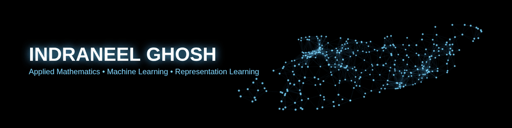

  

# Hi, I'm Indraneel (Neel) 👋

M.Tech CSE @ IIT Bombay (2024–2027) · Research Assistant @ CFILT Lab

I work on speech and language technology for Indian languages — Hindi song ASR, transliteration across Indic scripts, and the messy real-world ML systems that tie them together. Theory-strong in ML/DL, with research experience in NLP and speech processing.

---

## 🔬 What I'm working on

- **Hindi Song ASR** — Fine-tuning Whisper (Medium / large-v3-turbo) with LoRA for singing-voice transcription. Encoder-centric adaptation on dual-H100 with DDP via `torchrun`. Standalone benchmark: 12.12% CER / 29.06% WER.
- **Indic Transliteration Engine** — Syntax-based transliteration across 9 Indic scripts + Romanized Latin (Devanagari, Bengali, Gurmukhi, Gujarati, Odia, Tamil, Telugu, Kannada, Malayalam) — 45 bidirectional language pairs.
- **LM Reranker (Shallow Fusion)** — Trained an LM reranker over IndicXlit for Romanized Hindi → Devanagari back-transliteration. Cut **WER 25% → 8%** and **CER 9% → 3%** on 2,000 proprietary Hindi song lyrics.

All under a Saregama-sponsored project at CFILT, where I'm the sole researcher.

---

## 🧰 Tech

**Languages**

**ML / DL**

**Tools & Infra**

**Domains:** ASR fine-tuning · NLP · Multilingual NLP · LLM fine-tuning · Vision-Language Modeling

---

## 📌 Selected projects

- **Encoder-Centric Whisper Fine-Tuning for Hindi Song ASR** — Identified an encoder representation bottleneck in speech-pretrained Whisper for singing voice; explored encoder-only LoRA, encoder+decoder LoRA, and frozen-encoder bottleneck-adapter variants.
- **Whisper Web Inference Interface** — Flask app wrapping the fine-tuned model: audio upload, multiple decode strategies, server-side WER/CER, and a vanilla-JS transliteration frontend covering all 9 scripts.
- **Hyperbolic Embeddings for Open-Vocabulary Segmentation** — SAM → CLIP → Poincaré-ball classification pipeline; improved mIoU 17.4 → 18.4 on ADE20K.

---

## 🎓 Education

- **M.Tech, Computer Science & Engineering** — IIT Bombay (2024–2027)
- **B.Tech, Electronics & Communication Engineering** — IIIT Pune

---

## 🌐 Connect

- GitHub: [neil-79](https://github.com/neil-79)
- LinkedIn: [neel11](https://linkedin.com/in/neel11)
